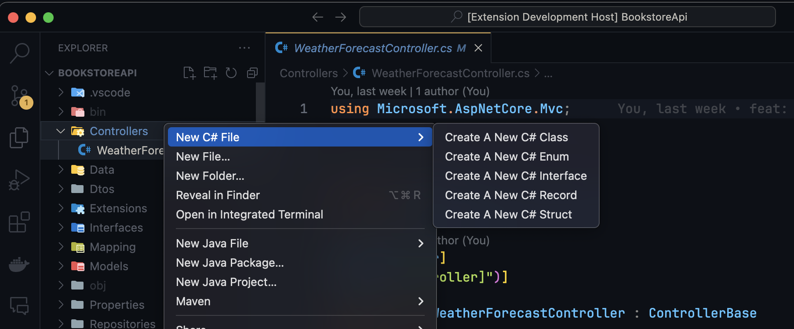
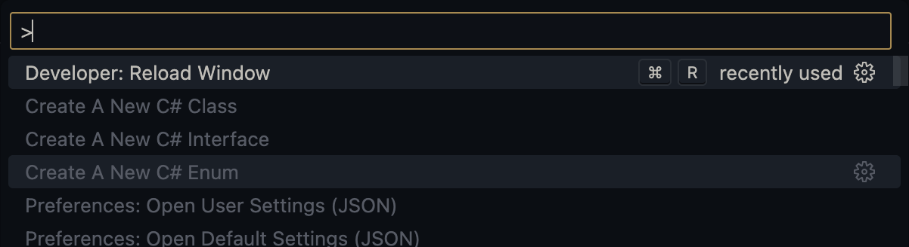

# CodeSharp 🎖️

Code Sharp is a [VsCode](https://code.visualstudio.com) extension tailored for .NET developers, designed to simplify the creation of C# file. Whether you’re working with classes, interfaces, or other file types, CodeSharp automates repetitive tasks, allowing you to focus on writing great code. Codesharp also adds automatically adds your project namespace to the file generated.

## Features 🔧

1. **Template-based file generation**: Generate C# files like classes, interfaces, or custom types using pre-defined or user-configured templates.
2. **Namespace handling**: Automatically derive the correct namespace based on your project structure.
3. **Intelligent file placement**: Files are generated in the currently active folder, with a fallback to the project’s root directory if no specific folder is selected.
4. **Smart C# File Detection**: Intelligently activates and provides C# file templates only when you're working on a C# or .NET project. This ensures

- **Automatic Detection**: The extension will detect if you're working within a C#-related environment (i.e., when .cs, .csproj, .sln, or other related files are present).

- **Selective Loading**: If you're working outside of a C# or .NET project, CodeSharp stays idle, ensuring that it doesn't clutter your workspace or consume unnecessary resources.

This behavior makes CodeSharp lightweight and highly optimized for C# developers, while staying out of the way for non-C# projects.

## Getting Started 🏃

### Installation 💽

1. Open Visual Studio Code.
2. Go to the Extensions view by clicking on the Extensions icon in the Activity Bar or pressing `Ctrl+Shift+X` or `CMD+Shift+X` if your're on a Mac.
3. Search for CodeSharp and click Install.
4. Alternatively, you can install the extension directly from the [VsCode Marketplace](https://marketplace.visualstudio.com).

### Usage 🧰

Before using CodeSharp, make sure you're in a C# or .NET related workspace. Otherwise it wouldn't work. See why [Here](https://github.com/Adedoyin-Emmanuel/codesharp?tab=readme-ov-file#features-)

1. Right-click on a folder or within the file explorer and select "New C# File". 
2. Choose the type of file you want to generate (e.g., Class, Interface, etc.).
3. Enter the desired name for the file.
4. The file will be generated in the selected folder with the correct namespace and template content.

You can also use the command panel pressing `Ctrl+Shift+P` or `CMD+Shift+P` if you're on a Mac. And then search `Create A New C#` this will bring up several options, you can the choose the type you want. Check the image below

## Contributing 🤝

First off, thanks for taking the time to contribute!

1. Star the repository, you can then create a fork
2. Clone your fork. Install the dependencies.
3. Create a branch for your feature (You can as well create an issue on that, so you can link it to your PR)
4. Commit your changes and push (Please give a descriptive message)
5. Submit your PR
6. Wait for your PR to be reviewed and merged

## License 📖

CodeSharp is [MIT-licensed](LICENSE) open-source software by [Adedoyin Emmanuel Adeniyi](https://github.com/adedoyin-emmanuel) and [contributors](https://github.com/adedoyin-emmanuel/codesharp/graphs/contributors):

## Author 👨

Hi there. I'm Adedoyin Emmanuel Adeniyi, a Software Engineer. I built CodeSharp to ease my C# projects development. I found myself manually creating classes, interfaces and then manually writing the namespace although I expected the [C# VsCode Extension](https://marketplace.visualstudio.com/items?itemName=ms-dotnettools.csdevkit) to allow devs create C# files types like classes, interfaces etc from the file explorer context menu but this isn't in place. That's why I built CodeSharp. The name was inspired my the term `code` and `sharp` from `csharp`.

My Portfolio <https://adedoyinemmanuel.dev>

You can contact me via <hi@adedoyinemmanuel.dev>

See my other Projects here <https://github.com/adedoyin-emmanuel>
